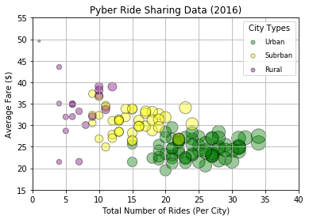
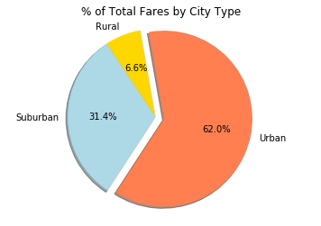
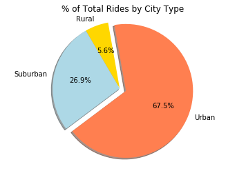
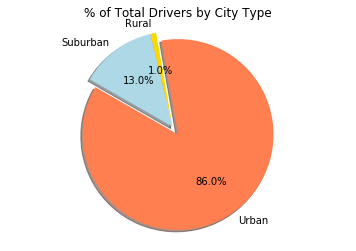

# Matplotlib
# Pyber Activity

## Analysis
- Urban drivers make up majority of the rides, then Suburban, then rural.
- Average Rural fares are higher than Urban and Suburan ride fares.
- Rural drivers should be promoted higher in order to grab higher ride fares.


```python
#Dependencies
import matplotlib.pyplot as plt
import numpy as np
import seaborn as sb
import pandas as pd
```


```python
city_file = "Raw_Data/city_data.csv"
ride_file = "Raw_Data/ride_data.csv"
```


```python
#Read in CSV Files (Raw Data)
city_df = pd.read_csv(city_file)
ride_df = pd.read_csv(ride_file)
```


```python
ride_df.head()
```


<div>
<style>
    .dataframe thead tr:only-child th {
        text-align: right;
    }

    .dataframe thead th {
        text-align: left;
    }

    .dataframe tbody tr th {
        vertical-align: top;
    }
</style>
<table border="1" class="dataframe">
  <thead>
    <tr style="text-align: right;">
      <th></th>
      <th>city</th>
      <th>date</th>
      <th>fare</th>
      <th>ride_id</th>
    </tr>
  </thead>
  <tbody>
    <tr>
      <th>0</th>
      <td>Sarabury</td>
      <td>2016-01-16 13:49:27</td>
      <td>38.35</td>
      <td>5403689035038</td>
    </tr>
    <tr>
      <th>1</th>
      <td>South Roy</td>
      <td>2016-01-02 18:42:34</td>
      <td>17.49</td>
      <td>4036272335942</td>
    </tr>
    <tr>
      <th>2</th>
      <td>Wiseborough</td>
      <td>2016-01-21 17:35:29</td>
      <td>44.18</td>
      <td>3645042422587</td>
    </tr>
    <tr>
      <th>3</th>
      <td>Spencertown</td>
      <td>2016-07-31 14:53:22</td>
      <td>6.87</td>
      <td>2242596575892</td>
    </tr>
    <tr>
      <th>4</th>
      <td>Nguyenbury</td>
      <td>2016-07-09 04:42:44</td>
      <td>6.28</td>
      <td>1543057793673</td>
    </tr>
  </tbody>
</table>
</div>


```python
city_df.head()
```


<div>
<style>
    .dataframe thead tr:only-child th {
        text-align: right;
    }

    .dataframe thead th {
        text-align: left;
    }

    .dataframe tbody tr th {
        vertical-align: top;
    }
</style>
<table border="1" class="dataframe">
  <thead>
    <tr style="text-align: right;">
      <th></th>
      <th>city</th>
      <th>driver_count</th>
      <th>type</th>
    </tr>
  </thead>
  <tbody>
    <tr>
      <th>0</th>
      <td>Kelseyland</td>
      <td>63</td>
      <td>Urban</td>
    </tr>
    <tr>
      <th>1</th>
      <td>Nguyenbury</td>
      <td>8</td>
      <td>Urban</td>
    </tr>
    <tr>
      <th>2</th>
      <td>East Douglas</td>
      <td>12</td>
      <td>Urban</td>
    </tr>
    <tr>
      <th>3</th>
      <td>West Dawnfurt</td>
      <td>34</td>
      <td>Urban</td>
    </tr>
    <tr>
      <th>4</th>
      <td>Rodriguezburgh</td>
      <td>52</td>
      <td>Urban</td>
    </tr>
  </tbody>
</table>
</div>


```python
city_data = pd.merge(ride_df, city_df, how="left", on=["city","city"])
```


```python
city_data.head()
```


<div>
<style>
    .dataframe thead tr:only-child th {
        text-align: right;
    }

    .dataframe thead th {
        text-align: left;
    }

    .dataframe tbody tr th {
        vertical-align: top;
    }
</style>
<table border="1" class="dataframe">
  <thead>
    <tr style="text-align: right;">
      <th></th>
      <th>city</th>
      <th>date</th>
      <th>fare</th>
      <th>ride_id</th>
      <th>driver_count</th>
      <th>type</th>
    </tr>
  </thead>
  <tbody>
    <tr>
      <th>0</th>
      <td>Sarabury</td>
      <td>2016-01-16 13:49:27</td>
      <td>38.35</td>
      <td>5403689035038</td>
      <td>46</td>
      <td>Urban</td>
    </tr>
    <tr>
      <th>1</th>
      <td>South Roy</td>
      <td>2016-01-02 18:42:34</td>
      <td>17.49</td>
      <td>4036272335942</td>
      <td>35</td>
      <td>Urban</td>
    </tr>
    <tr>
      <th>2</th>
      <td>Wiseborough</td>
      <td>2016-01-21 17:35:29</td>
      <td>44.18</td>
      <td>3645042422587</td>
      <td>55</td>
      <td>Urban</td>
    </tr>
    <tr>
      <th>3</th>
      <td>Spencertown</td>
      <td>2016-07-31 14:53:22</td>
      <td>6.87</td>
      <td>2242596575892</td>
      <td>68</td>
      <td>Urban</td>
    </tr>
    <tr>
      <th>4</th>
      <td>Nguyenbury</td>
      <td>2016-07-09 04:42:44</td>
      <td>6.28</td>
      <td>1543057793673</td>
      <td>8</td>
      <td>Urban</td>
    </tr>
  </tbody>
</table>
</div>


## Bubble Plot of Ride Sharing Data


```python
urban_group = city_data[city_data["type"] == "Urban"]
suburban_group = city_data[city_data["type"] == "Suburban"]
rural_group = city_data[city_data["type"] == "Rural"]
```


```python
urban_count = urban_group.groupby(["city"]).count()["ride_id"]
urban_fare = urban_group.groupby(["city"]).mean()["fare"]
urban_driver = urban_group.groupby(["city"]).mean()["driver_count"]
```


```python
suburban_count = suburban_group.groupby(["city"]).count()["ride_id"]
suburban_fare = suburban_group.groupby(["city"]).mean()["fare"]
suburban_driver = suburban_group.groupby(["city"]).mean()["driver_count"]
```


```python
rural_count = rural_group.groupby(["city"]).count()["ride_id"]
rural_fare = rural_group.groupby(["city"]).mean()["fare"]
rural_driver = rural_group.groupby(["city"]).mean()["driver_count"]
```


```python
plt.scatter(urban_count, 
            urban_fare, 
            marker="o", 
            facecolors="green", 
            s=urban_count*10,
            linewidth=1,
            edgecolor="black",
            label="Urban",
            alpha=0.4)

plt.scatter(suburban_count, 
            suburban_fare, 
            marker="o", 
            facecolors="yellow", 
            s=suburban_count*10,
            linewidth=1,
            edgecolor="black",
            label="Subrban",
            alpha=0.4)

plt.scatter(rural_count, 
            rural_fare, 
            marker="o", 
            facecolors="purple", 
            s=rural_count*10,
            linewidth=1,
            edgecolor="black",
            label="Rural",
            alpha=0.4)

plt.xlim(0,40)
plt.ylim(15,55)
plt.title("Pyber Ride Sharing Data (2016)")
plt.xlabel("Total Number of Rides (Per City)")
plt.ylabel("Average Fare ($)")
plt.grid(True)

legend = plt.legend(fontsize="small", 
                    numpoints=1, 
                    scatterpoints=1, 
                    title="City Types", 
                    labelspacing=1)

legend.legendHandles[0]._sizes=[25]
legend.legendHandles[1]._sizes=[25]
legend.legendHandles[2]._sizes=[25]
```


```python
plt.show()
```





## Total Fares by City Type


```python
fare_percents = city_data.groupby(["type"]).sum()["fare"] / city_data["fare"].sum() * 100
ride_percents = city_data.groupby(["type"]).sum()["ride_id"] / city_data["ride_id"].sum() * 100
driver_percents = city_data.groupby(["type"]).sum()["driver_count"] / city_data["driver_count"].sum() * 100
```


```python
#% of Total Fares by City Type
labels = ["Rural","Suburban","Urban"]
colors = ["gold","lightblue","coral"]

explode = (0,0,0.1)

plt.title('% of Total Fares by City Type')

plt.pie(fare_percents, 
        autopct= '%1.1f%%', 
        explode=explode, 
        labels=labels, 
        colors=colors, 
        shadow=True, 
        startangle=100)

plt.axis("equal")
plt.show()
```





## Total Rides by City Type


```python
#% of Total Rides by City Type
labels = ["Rural","Suburban","Urban"]
colors = ["gold","lightblue","coral"]
explode = (0,0,0.1)
plt.title('% of Total Rides by City Type')

plt.pie(ride_percents, 
        autopct='%1.1f%%',
        explode=explode, 
        labels=labels, 
        colors=colors, 
        shadow=True, 
        startangle=100)

plt.axis("equal")
plt.show()
```





## Total Drivers by City Type


```python
#% of Total Drivers by City Type
labels = ["Rural","Suburban","Urban"]
colors = ["gold","lightblue","coral"]
explode = (0,0,0.1)
plt.title('% of Total Drivers by City Type')

plt.pie(driver_percents, 
        autopct='%1.1f%%',
        explode=explode, 
        labels=labels, 
        colors=colors, 
        shadow=True, 
        startangle=100)

plt.axis("equal")
plt.show()
```




